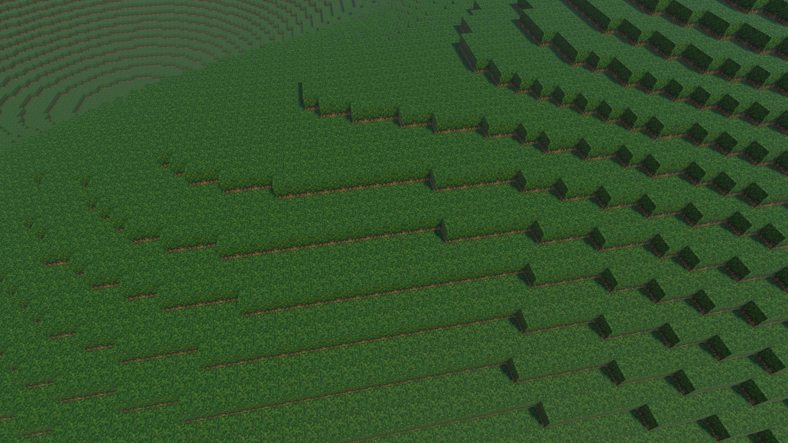
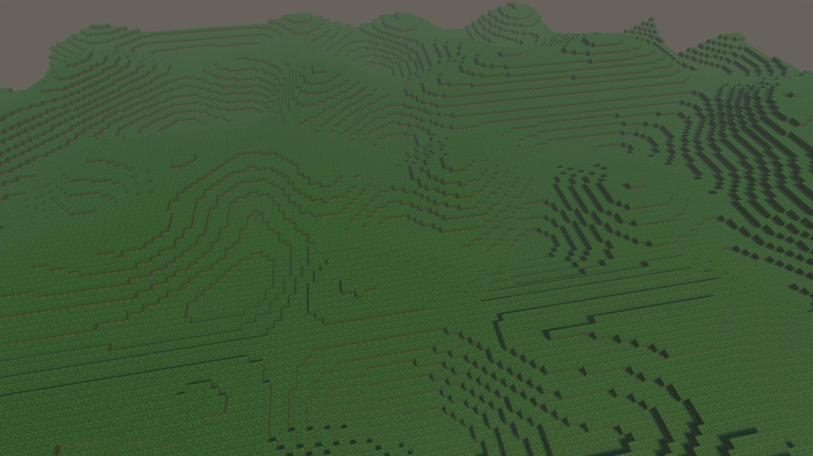
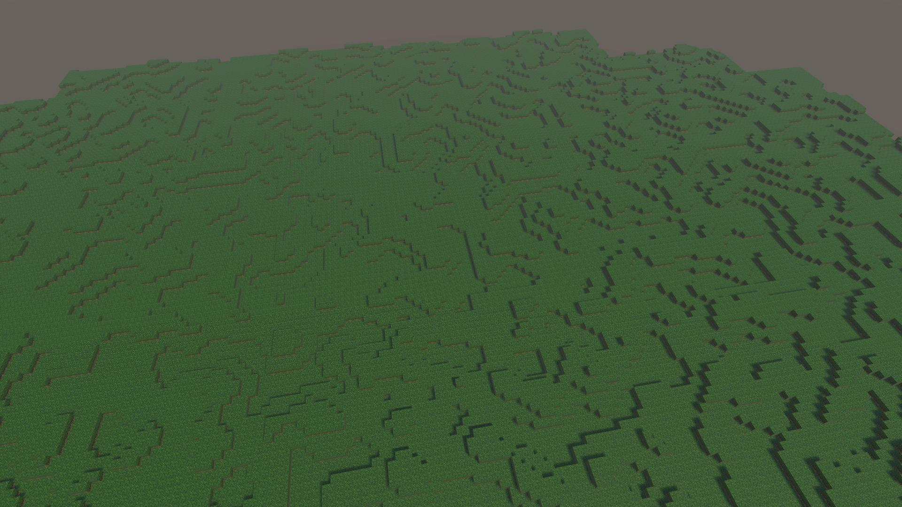
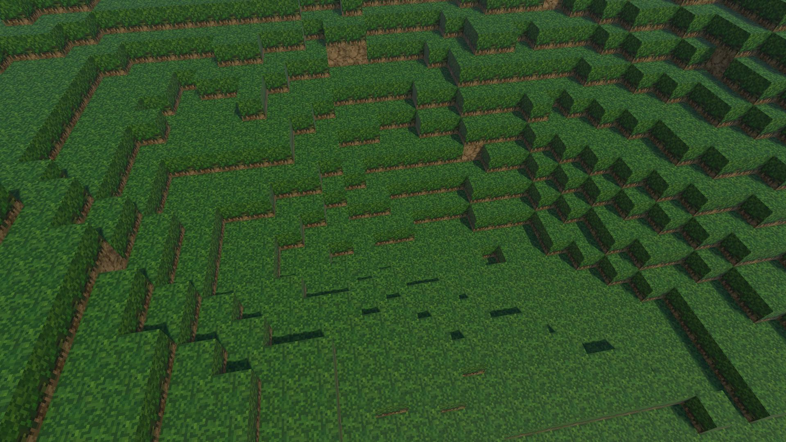
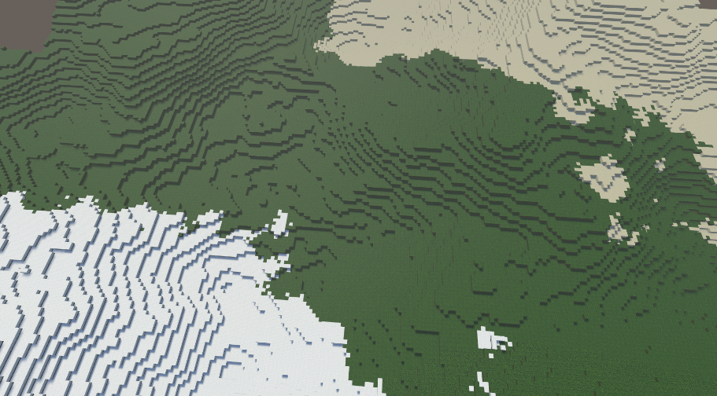
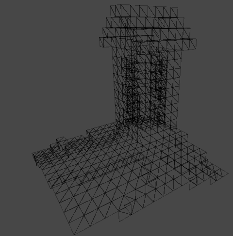
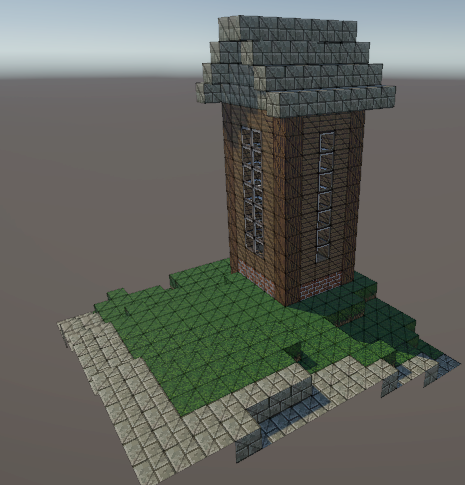
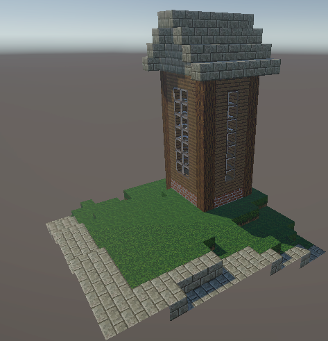
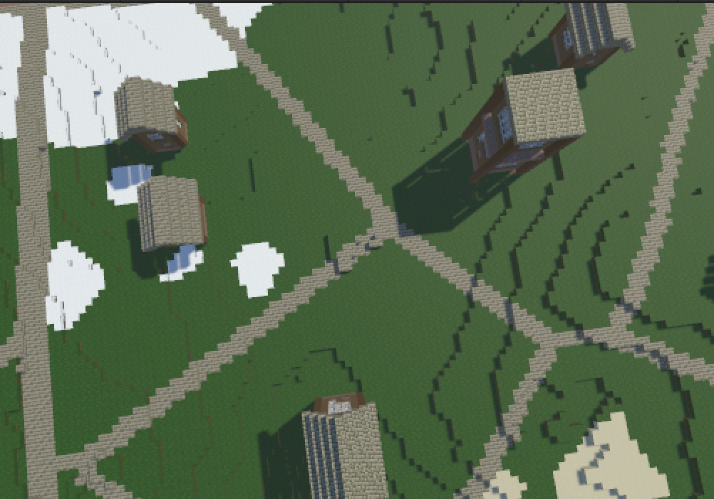
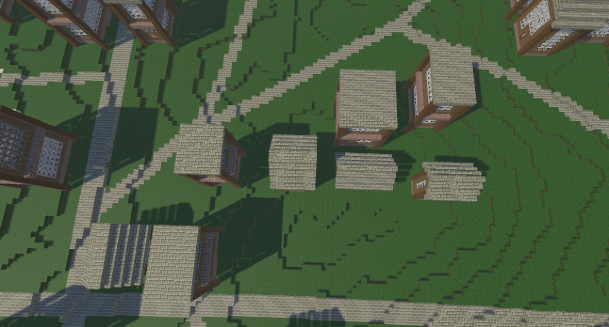

Group: David Yang, Oliver Petrick, Ryan Alameddine, and Nick Jiang

## Abstract
Taking inspiration from Minecraft world generation, this project procedurally generates an infinite world with complex terrains, biomes, and natural, walkable cities. 
The goal is to help urban planners easily visualize new city designs with changeable parameters. Additionally, there is an interactive component to it where the user 
can move around the world using the WASD keys and space bar.

## Video
<iframe width="784" height="441" src="https://www.youtube.com/embed/DerSaJTplfA?si=mbUJRmaSsk09kbiq" title="YouTube video player" frameborder="0" allow="accelerometer; autoplay; clipboard-write; encrypted-media; gyroscope; picture-in-picture; web-share" referrerpolicy="strict-origin-when-cross-origin" allowfullscreen></iframe>

[Milestone Video](https://youtu.be/DerSaJTplfA)
     
## Technical Approach

### World Structure

The infinite world is organized into an implicit grid structure at various granularities, as shown above. Not shown is the y axis, in which a single chunk contains 16x16x128 blocks. 
Blocks are the abstract units of our gridded generation space. Chunks are collections of blocks which are represented as a single triangle mesh and drawn to the screen. Megachunks are 
abstract groups of chunks which correspond to a single block of a city.

### An Infinite World

The movement logic utilizes the Unity physics engine. Firstly, the player and the world meshes (described below) both have colliders attached to them to check for interaction between them. If the player is in walking mode, there is a friction force applied to the player, and the player can then use the movement keys to apply forces in any direction. The player can also jump, which applies a vertical force. In flying mode, the mechanics are more simple. If the player wants to move in any direction, their velocity is adjusted as needed.
As the player moves around, different chunks come in and out of range. New chunks are generated on the fly, and out-of-range chunks are deactivated, providing a never-ending procedural world!

### The Pipeline

Our generation algorithm is built as a pipeline, with a variety of ordered steps described in the sections below. At a high level:
We sample a circular radius around the player in chunk space and megachunk space. For each uninitialized megachunk, we queue it for planning (1). We instantiate new chunks whose containing megachunk is planned, and queue them for materialization (2). We then queue each materialized chunk for meshing (3). The final meshed output is then displayed to the screen (4).

#### 1: Megachunk Planning

We wanted our cities to be walkable and have a natural look to them. Thus, we chose to model them after Voronoi diagrams, which can be used to model radial growth from a set of starting points.
Here, each black dot is a starting point and the cells grow until they contact neighboring cells. Edges and vertices naturally form from this expansion. We then have each cell be a “neighborhood” and each edge is a road/sidewalk. We decided to use the Jump Flooding Algorithm O(n2 * log(n)) which is a cool approximation algorithm for Voronoi diagrams and allows us to nicely check if a Block lies on an edge. 

[images]

#### 2: Chunk Materialization
This pipeline step populates a Chunk’s 3D array of blocks using information from the height map, biome map, and megachunk plan.

##### 2a: Terrain Materialization

Octave 1                   |  Octave 2
:-------------------------:|:-------------------------:
  |  
**Octave 3**                  |  **Octave Sum**
  |  

The core of our terrain generation is the Perlin Noise algorithm (not implemented by us), which generates pseudo-random “smooth” noise.  Our final height map samples from multiple octaves and sums the result. Each octave is a separate Perlin Noise map, increasing in frequency and decreasing in amplitude (see examples above).

Next, we generate a biome map using another stack of Perlin octaves. This time, instead of using the resulting sample as a height value, we mark low values as desert, medium as plains, and high as taiga. This ensures smooth biome distribution, and that deserts and taigas don’t fall directly adjacent to each other.

To materialize these maps into our 3D block array, we sample from both maps at each (x,z) coordinate. At that height, we place grass/snow/sand (depending on the biome sample). We place dirt underneath, and then stone deep below.

##### 2b: Road Materialization
Since the road generating algorithm is implemented in Megachunk planning, here we just need to materialize the roads within each Chunk. We simply loop through the set of road coordinates and check if each coordinate is within the coordinates of our current chunk. If it is, we add it to our 3D block array for it to be materialized.

##### 2c: House Materialization
We implement a placement algorithm for homes that ensures that they are placed on even terrain and have a buffer away from roads. Thus, hilly and road-heavy areas should have a sparse distribution of homes. For each chunk, we sample a width, height, and depth. Then, we iterate through the grid of blocks and check whether the proposed placement has uneven terrain and if there exist any roadblocks within buffer blocks away in any direction. If both conditions are satisfied, we will push the new house to our array and add a small buffer to search for the next home (to prevent homes from being stacked next to each other). This algorithm maximizes the number of homes within a megachunk while maintaining separation from roads, creating privacy-centric neighborhoods.
We materialize the houses by taking in their location of them from the placement algorithm. Knowing the location, length, width, and height, the houses are materialized by placing the appropriate blocks in the 3D block array. Additionally, if the home’s height is above a certain threshold, a different style of house is generated. The structure of these houses is adjusted depending on their dimensions to fit a consistent architecture. Depending on the biome the home home is in, the blocks that make up the homes are different. 

#### 3: Chunk Meshing
In this pipeline step, an optimized triangle mesh is created from a Chunk’s 3D block array. Each block in a chunk has six potential faces. For each potential face, we check if the adjacent block is transparent (air, glass, etc). If so, we add the four vertices and two triangles needed. Instead of standard UV coordinates, we supply the shader UV-W coordinates, where W is the index in our texture array of the corresponding block face. 
The core of our terrain generation is the Perlin Noise algorithm, which generates pseudo-random “smooth” noise. 
You can see examples with different frequencies and amplitudes in the octave images above. 
We use this to generate a height map by sampling from each octave and summing the result. We place grass on the top, dirt underneath, and stone far below. 

Wireframe                   |  Mesh                 |  Final Mesh
:-------------------------:|:-------------------------:|:-------------------------:
  |   |  

#### 4: Rendering
At this point, most of the rendering work is done by Unity. However, we wrote a simple shader for the chunk meshes which uses a uvw coordinate input to sample from a specific texture from our block texture array before passing back into Unity.  

### Problems Encountered

1. Performance Issues and Optimizations
     i. Meshing: the naive solution (generate a cube mesh for each block) failed to run at 60fps with even a single chunk (16x16x128=32,768 possible blocks). Our optimized solution (fewer vertices, fewer triangles, fewer gpu objects, and fewer unit objects) can run at 60fps with hundreds of chunks.
     ii. Pipeline efficiency & synchronization: As you might have noticed, our generation logic requires a significant amount of work for our cpu. In just a single megachunk (8x8 chunk block), there are 2,097,152 blocks to generate! And yet, we are able to smoothly generate the world as the player moves and explores using some careful multithreading. Basically, each pipeline step 1-3 is partitioned across different threads. All of this is synchronized using an AsyncQueue abstraction we created, which takes ownership of its input and asynchronously spits out processed outputs. No mutable data is shared between threads and the main thread is never blocked, so don’t have to worry about deadlock or other synchronization issues.
2. Voronoi Diagrams
     a. Simple implementations of Voronoi diagrams take O(n2) time; however, we ran into a challenge of easily converting from the outputted edge endpoints to a set of Blocks that intersect the edge. This is why we decided to use the JFA, a much easier way of implementing approximate Voronoi diagrams. 
     b. How to adapt the Voronoi generation to an infinite context - we created a “megachunk” abstraction where we produce a voronoi diagram per megachunk and add a further step to connect the trails together
3. Home/Building Placement
- We wanted neighborhoods to feel tight-knit but also private. As a result, we added a buffer between walking trails and homes.
  
### Lessons Learned
- Early infrastructure (code organization, optimizations) is crucial for building later features
- Optimizations are important for procedural generation because speed easily becomes an issue
- How to adapt finite algorithms to an infinite, pseudorandom generated world. 

## Results

<iframe src="https://giphy.com/embed/Vig9qkktCbxWH2BnZb" width="480" height="248" frameBorder="0" class="giphy-embed" allowFullScreen></iframe>
<a href="https://giphy.com/gifs/Vig9qkktCbxWH2BnZb">Procedural Generation GIF</a>

Final Image 1                   |  Final Image 2
:-------------------------:|:-------------------------:
  |  

## References

1. [Procedurally Generating Terrain Paper](https://micsymposium.org/mics_2011_proceedings/mics2011_submission_30.pdf)
2. [Jump Flooding Algorithm Paper](https://www.comp.nus.edu.sg/~tants/jfa/i3d06.pdf)

## Contributions
- Nick: House placement algorithm (factoring raods and terrain) and optimizations, house materialization
- Oliver: Player interactivity, houes materialization, biome materialization, and texturing
- David: Basic house materialization, Voronoi diagram using Jump Flooding Algorithm (for road generation), road materialization, webpages
- Ryan: Core pipeline, block mesh generation and optimization, terrain/biome generation algorithm, multithreading primitives

[Just the Docs]: https://just-the-docs.github.io/just-the-docs/
[GitHub Pages]: https://docs.github.com/en/pages
[README]: https://github.com/just-the-docs/just-the-docs-template/blob/main/README.md
[Jekyll]: https://jekyllrb.com
[GitHub Pages / Actions workflow]: https://github.blog/changelog/2022-07-27-github-pages-custom-github-actions-workflows-beta/
[use this template]: https://github.com/just-the-docs/just-the-docs-template/generate
