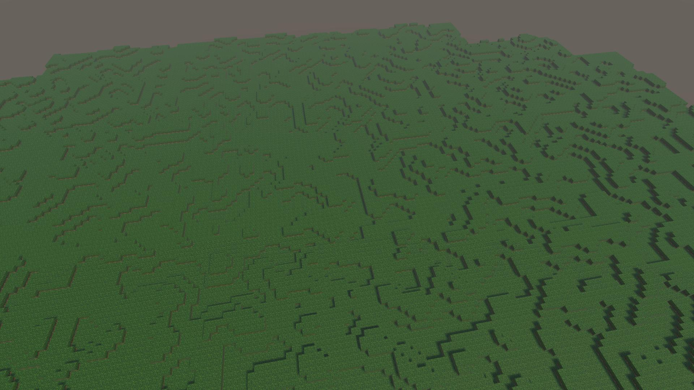
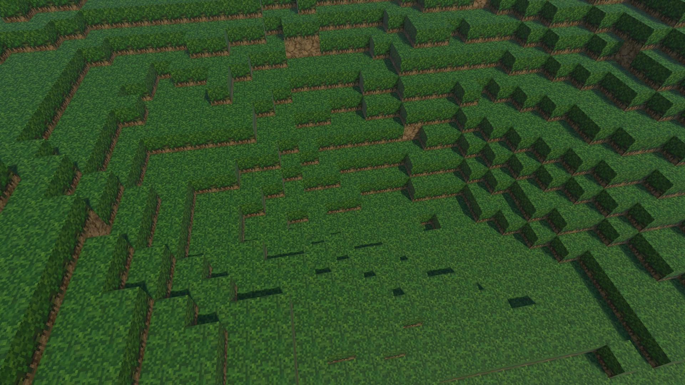

Group: David Yang, Oliver Petrick, Ryan Alameddine, and Nick Jiang

## Summary
Taking inspiration from Minecraft world generation, this project will procedurally generate an infinite world with
complex terrains and cities. Additionally, there will be an interactive component to it where the user can move around 
the world using the WASD keys and space bar.      

## Slides

<!-- this is the embed code provided by Google -->
 <iframe src="https://docs.google.com/presentation/d/e/2PACX-1vTMRT2ORdzsPRwqJX6j8WVo78PR9HfdKeu6xztUjLtWyNPYo2gjyYwP-WvsoFZvuRb3NImf2mL4iYIx/embed?start=false&loop=false&delayms=3000" frameborder="0" width="960" height="569" allowfullscreen="true" mozallowfullscreen="true" webkitallowfullscreen="true"></iframe>
<!-- Google embed ends -->

[Milestone Slides](https://docs.google.com/presentation/d/1pH4gPwxhiTxhNro02AIRPbZl5zIW7kam_F1DCjj2xpc/edit#slide=id.p)

## Video
<iframe width="560" height="315" src="https://www.youtube.com/embed/DerSaJTplfA?si=mbUJRmaSsk09kbiq" title="YouTube video player" frameborder="0" allow="accelerometer; autoplay; clipboard-write; encrypted-media; gyroscope; picture-in-picture; web-share" referrerpolicy="strict-origin-when-cross-origin" allowfullscreen></iframe>

[Milestone Video](https://youtu.be/DerSaJTplfA)
     
## Current Progress

### Procedural Terrain Generation

Octave 1                   |  Octave 2
:-------------------------:|:-------------------------:
  |  
**Octave 3**                  |  **Octave Sum**
  |  

The core of our terrain generation is the Perlin Noise algorithm, which generates pseudo-random “smooth” noise. 
You can see examples with different frequencies and amplitudes in the octave images above. 
We use this to generate a height map by sampling from each octave and summing the result. We place grass on the top, dirt underneath, and stone far below. 

### Procedural Building Generation
To place the houses within each Chunk, we first sample a random width and depth and iterate through each block of the xz plane in the chunk. For each block, we check that the projected space for house’s foundation (add width along the x-axis, depth along the z-axis) is the same height; we don’t want to place a home on an uneven surface. If we find a suitable placement, we add a small buffer so that the homes are not directly next to one another and repeat the height checking.

Next, the house object is materialized with the rest of the Chunk blocks. The texture of the house is determined by its height which is also randomly generated. If the height is less than or equal to a certain constant, it's considered a small house and given a random color for walls and an overhangging roof. If the height is greater, it's considered a tall building and given brick texture.

### Block Textures
While creating meshes for each chunk, we assign UV coordinates to each face in accordance with the block type. In particular, we actually have a 3D UVW space, where W selects which block texture to use. We wrote a simple shader which uses this W coordinate to select the texture to sample from a texture array, and then forwards the UV sampled color from the selected texture to a standard Unity Shader.

### Player Movement
There is a player in the world which is controlled by the WASD keys. It can jump around with gravity but can also switch to a flying mode by double tapping jump (space bar). The player interacts with all the blocks in the world through collisions.

### Multithreading
Even with our mesh generation optimizations (only showing faces which are not covered by another block), this was still too slow to generate many chunks at 60fps. Thus, we offloaded generation work onto other threads.
By default, we use two threads to materialize chunks, and two threads to generate meshes.
We synchronized this using an AsyncQueue synchronization structure we created, which is basically a thread-safe channel which performs computation on data before passing it into the output.
This way, all shared data outside the channel input/output is immutable and the main thread never sleeps, so we cannot have synchronization issues or deadlock.

     
## Preliminary Results

*World terrain with randomized buildings*

The preliminary results are definitely promising. We have terrain of different heights, player movement, basic building generation, and multithreading.
The video is a better demonstration of our results.
   
### Updated Schedule
  
*Basic Voronoi diagram*

We are doing good on progress relative to our original schedule. For the next two weeks, we will be working on advanced city generation and our aspirational goals.
One implementation we will be looking into are Voronoi diagrams to create the main roads of our world. These diagrams also split the world into natural "neighborhoods" for us to place buildings.

- Week 3: Advanced city generation (Voronoi diagram roads), more buildings, begin working on aspirational goals
- Week 4: Implement additional optimizations if needed and additional aspirational goals as time allows

[Just the Docs]: https://just-the-docs.github.io/just-the-docs/
[GitHub Pages]: https://docs.github.com/en/pages
[README]: https://github.com/just-the-docs/just-the-docs-template/blob/main/README.md
[Jekyll]: https://jekyllrb.com
[GitHub Pages / Actions workflow]: https://github.blog/changelog/2022-07-27-github-pages-custom-github-actions-workflows-beta/
[use this template]: https://github.com/just-the-docs/just-the-docs-template/generate
